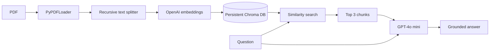

# PDF RAG Pipeline

A compact retrieval-augmented generation (RAG) pipeline that turns a PDF into a searchable knowledge base and uses the retrieved text to produce grounded answers.

The included example indexes *Attention Is All You Need*, but the loader can be pointed at any text-based PDF.

## How it works



The pipeline has two stages:

1. **Indexing** — load the PDF, split its pages into overlapping chunks, create OpenAI embeddings, and persist them in Chroma.
2. **Retrieval and generation** — embed a question, retrieve the three most similar chunks, and provide them to `gpt-4o-mini` as context for the answer.

## Tech stack

- Python 3.14+
- [LangChain](https://www.langchain.com/) for document and model orchestration
- [OpenAI](https://platform.openai.com/) for embeddings and answer generation
- [Chroma](https://www.trychroma.com/) for local vector storage
- [PyPDF](https://pypdf.readthedocs.io/) for PDF extraction
- [uv](https://docs.astral.sh/uv/) for dependency management

## Project structure

```text
.
├── data/
│   └── attention.pdf          # Example source document
├── src/rag_project/
│   ├── loader.py              # Loads PDF pages
│   ├── chunker.py             # Splits pages into overlapping chunks
│   └── retriever.py           # Retrieves context and generates an answer
├── embedder.py                # Embeds chunks and persists the Chroma index
├── pyproject.toml
└── uv.lock
```

The generated `data/chroma_db/` directory is local runtime data and is not committed.

## Getting started

### 1. Install dependencies

Install [uv](https://docs.astral.sh/uv/getting-started/installation/) if needed, then run:

```bash
uv sync
```

### 2. Configure OpenAI

Create a `.env` file in the project root:

```dotenv
OPENAI_API_KEY=your_api_key_here
```

Keep this file private. OpenAI API usage may incur charges.

### 3. Build the vector index

The default loader reads `data/attention.pdf`. Replace that file or update the path in `src/rag_project/loader.py` to index another PDF.

```bash
uv run python -c "from rag_project.loader import load_documents; from rag_project.chunker import chunk_documents; from embedder import embed_and_store; docs = load_documents(); chunks = chunk_documents(docs); embed_and_store(chunks); print(f'Indexed {len(chunks)} chunks')"
```

This creates a persistent Chroma database at `data/chroma_db/`.

### 4. Ask a question

Run the included example:

```bash
uv run python src/rag_project/retriever.py
```

Or ask a question from the command line:

```bash
uv run python -c "from rag_project.retriever import get_answer; print(get_answer('Why is self-attention useful?'))"
```

## Current defaults

| Setting | Value |
| --- | --- |
| Source PDF | `data/attention.pdf` |
| Chunk size | 1,000 characters |
| Chunk overlap | 200 characters |
| Retrieved chunks | 3 |
| Chat model | `gpt-4o-mini` |
| Vector database | `data/chroma_db/` |

## Notes

- The vector index must be built before retrieval.
- Scanned PDFs need OCR before `PyPDFLoader` can extract useful text.
- Re-indexing into the same Chroma directory may add duplicate content; remove or archive the existing index when rebuilding from scratch.
- This is a learning-oriented foundation rather than a production service. It does not yet include citations, conversational memory, an API, automated evaluation, or document-management commands.

## License

No license has been added yet. All rights are reserved by the repository owner.
